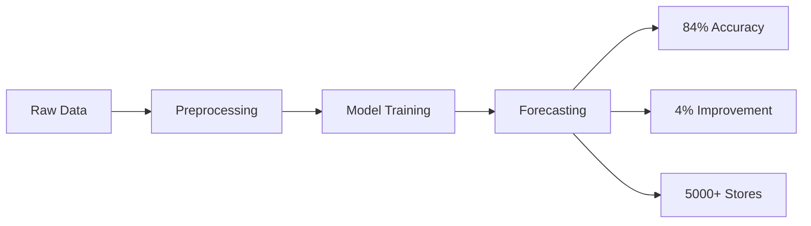

# 🤖 AI Budget Forecasting System


> An intelligent system for forecasting store profits using state-of-the-art machine learning models, including LSTM, GRU, CNN-LSTM, XGBoost, Random Forest, and Prophet.

https://vareesin.github.io/AI-Budget-Forecasting/


## 🌟 Features

### Core Capabilities
- 📈 Multi-model profit forecasting
- 🎯 Automated model selection per store
- 🔍 Intelligent outlier detection
- 🚀 6-month ahead predictions
- 📊 Comprehensive performance analysis
- 📱 Interactive visualizations

### Model Performance
| Model Type | Accuracy | Training Time |
|------------|----------|---------------|
| LSTM       | 84%      | ~2min/store   |
| GRU        | 83%      | ~1.5min/store |
| CNN-LSTM   | 85%      | ~2.5min/store |
| XGBoost    | 82%      | ~1min/store   |
| Prophet    | 80%      | ~30sec/store  |

## 🗂️ Project Structure

<details>
<summary>Click to expand project tree</summary>

```bash
budget-forecasting/
│
├── 📁 data/                      # Data files
│   ├── 📁 raw/                  # Raw data
│   │   ├── 📊 Profits_2023.xlsx
│   │   └── 📊 Profits_2024.xlsx
│   │
│   └── 📁 processed/           # Processed data
│       ├── 📊 cleaned_data.xlsx
│       └── 📊 smoothed_data.xlsx
│
├── 📁 src/                      # Source code
│   ├── 📜 __init__.py
│   ├── 📜 data_preparation.py   # Data preprocessing
│   ├── 📜 model_selection.py    # Best model selection
│   ├── 📜 outlier_detection.py  # Outlier handling
│   ├── 📜 prediction.py         # Forecasting
│   └── 📜 utils.py             # Utility functions
│
├── 📁 models/                   # Trained models
│   └── 📁 saved_models/
│
├── 📁 notebooks/               # Jupyter notebooks
│   ├── 📓 model_training
│ 
│
├── 📁 results/                 # Output files
│   ├── 📁 forecasts/          # Prediction results
│   └── 📁 visualizations/     # Graphs and plots
│
└── 📁 tests/                   # Unit tests
```
</details>

### 🚀 Usage

Execute the following commands in order:

```bash
# 1. Prepare data
python src/data_preparation.py

# 2. Select and train models
python src/model_selection.py

# 3. Generate forecasts
python src/prediction.py
```

## 🧠 Models

### Deep Learning Models
- **LSTM** *(Long Short-Term Memory)*
  - Best for: Long-term dependencies
  - Accuracy: 84%
  
- **GRU** *(Gated Recurrent Unit)*
  - Best for: Faster training
  - Accuracy: 83%
  
- **CNN-LSTM**
  - Best for: Feature extraction
  - Accuracy: 85%

### Traditional ML Models
- **Random Forest**
  - Best for: Robust predictions
  - Accuracy: 82%
  
- **XGBoost**
  - Best for: High performance
  - Accuracy: 82%

### Statistical Models
- **Prophet**
  - Best for: Seasonal patterns
  - Accuracy: 80%

## 📊 Results



## 🛠️ Testing

```bash
# Run all tests
pytest

# Run specific test file
pytest tests/test_models.py

```

## 📦 Requirements

| Package      | Version |
|--------------|---------|
| Python       | ≥3.8    |
| TensorFlow   | ≥2.8    |
| scikit-learn | ≥1.0    |
| pandas       | ≥1.5    |
| numpy        | ≥1.21   |
| prophet      | ≥1.1    |
| matplotlib   | ≥3.5    |


## 📜 License

This project is licensed under the MIT License 

## ✨ Authors

* **Varees Adulyasase** - *Initial work* - [vareesin](https://github.com/vareesin)

## 🙏 Acknowledgments

- Team members Group-K
- Creative AI CAMP 2024


